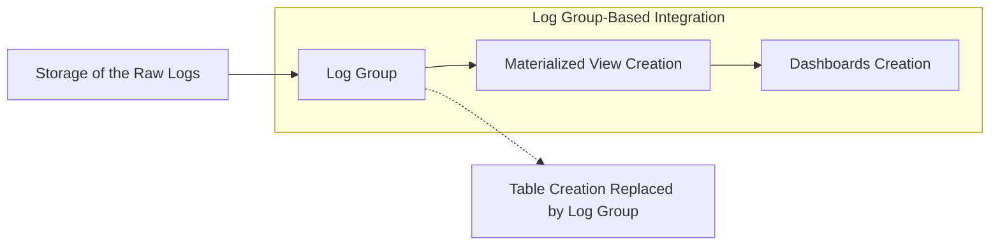

# SOP - OpenSearch Integration Setup

## Introduction

This document supplements the open-source version of the OpenSearch Integration Setup SOP by highlighting key differences and additional requirements specific to internal use cases, such as AWS integrations. Please refer to the open-source version for the general process, as this document only covers areas where the internal setup diverges.

## Key Differences in Log Group Based Integration Setup

### 1. Types of Integration

**Open-Source Version (S3 storage based):**
- Focuses on S3-based integrations for raw log storage.

**Log Group-Based Integration:**
- **Additional Integration** Type: AWS CloudWatch Log Groups
  - Allows integration directly from pre-structured CloudWatch Log Groups, bypassing the need for raw log storage and table creation.
  - Supports AWS Log Insights for prebuilt queries and visualizations.
  - **When to Use:**
    - Log data is laready available in AWS CloudWatch Log Groups
    - There is no need for custom table creation from raw logs

**Visualization of Differences:**

### 2. ~~Table Creation~~ Log Group Setup

**Open-Source Version (S3 storage based):**
- Requires explicit table creation queries for raw logs stored in S3.

**Log Group-Based Integration:**
- **No Table Creation Needed for CloudWatch Log Groups:**
  - Skip this step entirely when working with pre-structured log data in CloudWatch Log Groups.
  - Directly start from the Materialized View (MV) creation step.

### 3. Materialized View (MV) Creation

**Open-Source Version:**
- Details a generic query for MV creation, starting from user-created tables.

**Log Group-Based Integration:**
- The Materialized View (MV) query remains the same as described in the open-source version. However, when working with CloudWatch Log Groups, ensure the table references correctly point to the Log Group stream data instead of custom-created tables.

**Note:** Validate Log Group field mappings (logGroup, message, timestamp) for consistency with MV queries.

### 4. Dashboard Creation

**Open-Source Version (S3 storage based):**
- Covers creating dashboards using .ndjson files.

**Log Group-Based Integration:**
- Similar to the Open-Source version, developers must customize and edit .ndjson files to create dashboards that align with their metrics and services:
  - Define the required metrics in visualizations (e.g., counts, averages, sums).
  Ensure the dashboard layout supports monitoring needs.

## Reference

For all other steps, refer to the [open-source SOP](https://github.com/RyanL1997/nexus-opensearch-catalog/blob/main/docs/sop-integration-setup.md) as the primary guide. This Log Group-based document is intended to reduce redundancy and focus solely on AWS-specific adjustments.
