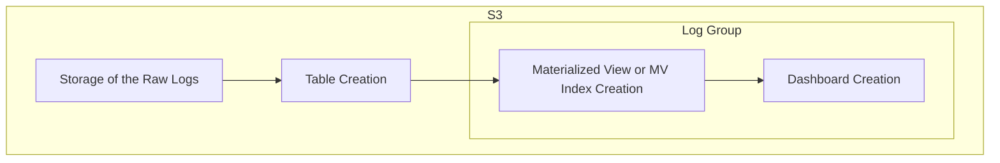

# SOP - OpenSearch Integration Setup

## Introduction

This document serves as a comprehensive guide for setting up and testing OpenSearch integrations. It outlines the key steps involved in the integration process and provides detailed instructions for creating and managing materialized views, as well as building and utilizing DQL visualizations. Additionally, it highlights common scenarios and challenges that users may encounter during these tasks, offering practical solutions and debugging strategies to address them effectively. By following this guide, users can streamline their workflows and ensure a smooth integration experience with OpenSearch.

## How OpenSearch Integration Works

The integration process typically follows these sequential steps:

- Storage of the Raw Logs: Collect and store raw log data in a designated location.
- Table Creation: Transform the raw log data into structured tables for processing.
- Materialized View (MV) or MV Index Creation: Create materialized views to aggregate and index the data for easier querying and analysis.
- Dashboard Creation: Use the MV index to build dashboards that visualize and analyze the data effectively.

## Types of Integration (Based on Source)

### 1. S3 Type Integration

As the name implies, this type uses an S3 bucket to store raw log data. The integration setup strictly follows all the steps outlined above, beginning with raw log storage and proceeding through table creation, materialized view creation, and dashboard configuration.

- When to Use: Choose this type if your raw logs are stored in S3 buckets and require processing from the ground up.
- Key Note: Ensure proper IAM permissions are configured for OpenSearch to access and process the data from your S3 bucket.

### 2. Log Group Type Integration (CloudWatch)

In this type, the raw log data is already processed and available in tables through AWS CloudWatch Log Groups. With this setup, you can bypass the initial steps of raw log storage and table creation. Instead, you can directly begin the integration from the materialized view creation step, leveraging AWS CloudWatch Log Insights and OpenSearch Dashboards.

- When to Use: Choose this type if you are working with CloudWatch Log Groups that already provide structured tables.
- Key Note: Utilize AWS CloudWatch Console’s native Log Insights to streamline dashboard creation directly from the materialized views.

## General Principles of OpenSearch Integration
Before diving into the detailed steps of the integration process, it is important to understand some general principles that govern the flow. These principles ensure seamless functionality across the integration, from table creation to dashboard visualization.

**1. Field Name Matching in Table and Materialized View (MV) Queries**

- The fields in the table used for the integration must match the field names specified in the SELECT section of the MV creation query.

**2. Table Name Alignment with MV Queries**

- The table name must match the table referenced in the MV creation query’s FROM clause.

**3. MV Index Field Name Consistency with Dashboards**

- The fields in the MV index must align with the field names referenced in the dashboards’ `.ndjson` visualization files.

**4. Index Name/Pattern in `.ndjson`**

- The `.ndjson` visualization file for dashboards must include the index name or index pattern associated with the MV index.

### Consequences of Mismatched Configurations

Any mismatch in the above elements can lead to:

- **Empty Results**: The MV index or dashboards may return no data.
- **Visualization Failures**: Dashboards may fail to render properly due to missing fields or incorrect index patterns.
- **MV Creation Failures**: The MV creation process itself may fail if table or field names do not align correctly.